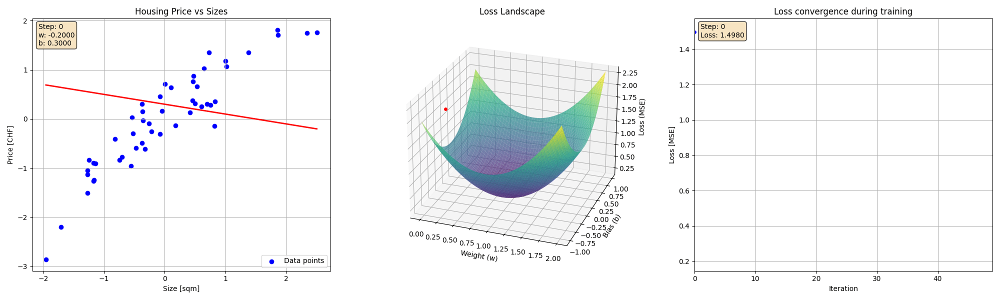
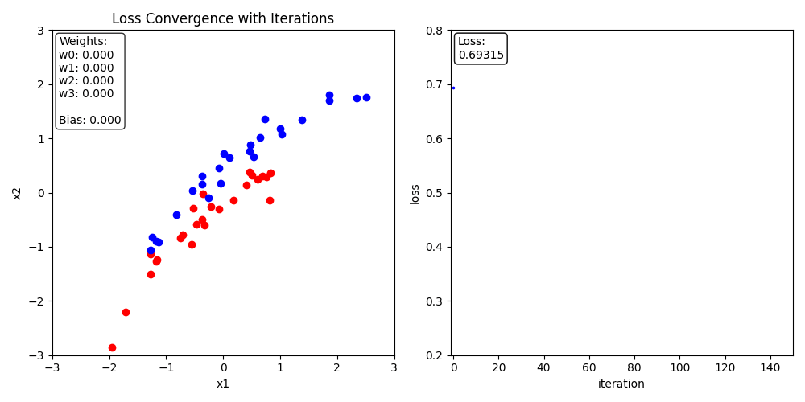
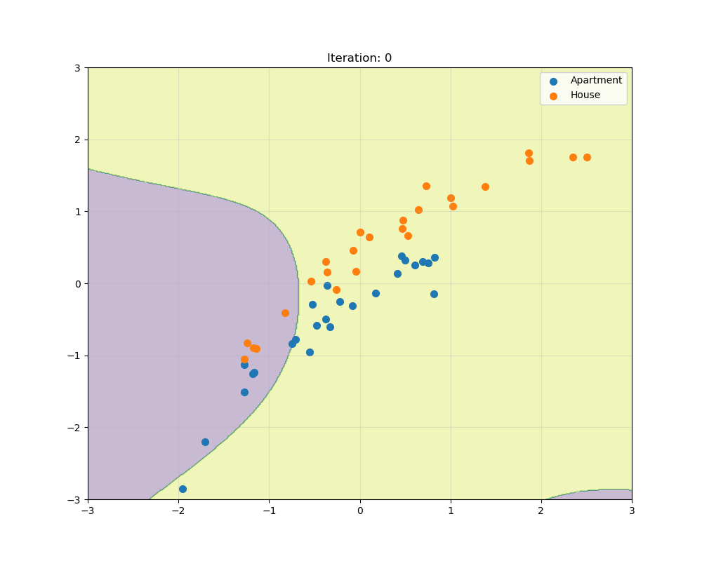
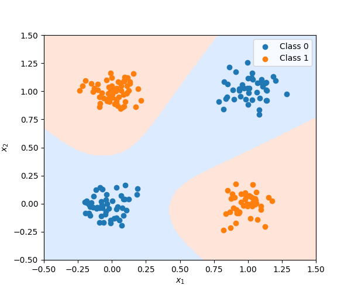
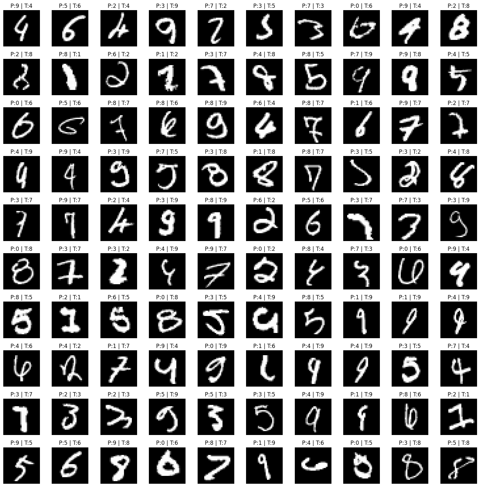
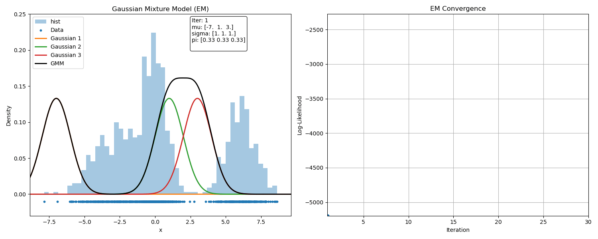
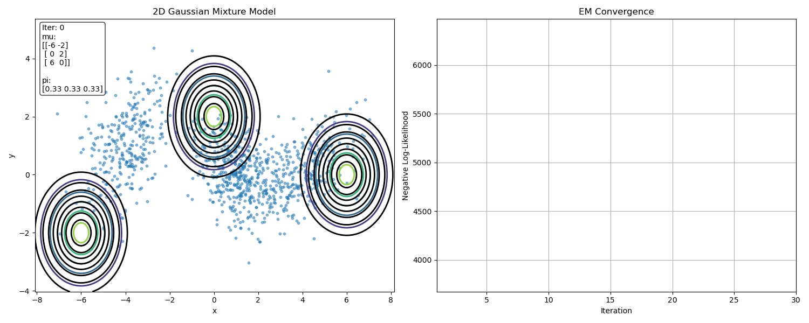

# FundamentalsOfML

A hands-on collection of machine learning algorithms implemented from scratch using NumPy and PyTorch, with detailed mathematical derivations, visualizations, animations, and gradient-based optimization. The goal of this repository is to build an intuitive and mathematical understanding of machine learning models by implementing every component manually, including forward propagation, loss functions, backpropagation, and parameter optimization.

The repository covers both classical machine learning algorithms and neural networks, with a strong focus on:
- mathematical intuition,
- matrix calculus,
- optimization techniques,
- gradient descent,
- and visualization of learning dynamics.

---

## Implemented Algorithms

- Linear Regression
- Logistic Regression
- KNN
- Decision Trees / BDT
- Vanilla Neural Networks
- PyTorch Models
- Gradient Descent & Decision Boundary Visualizations
- Principal Component Analysis (PCA)

- Expectation-Maximization (EM) Algorithm for Gaussian Mixture Models (GMM)

---

# Linear Regression

In this section, we begin by deriving the analytical solution of linear regression using least squares minimization. The normal equations are solved using QR decomposition and Gram-Schmidt orthogonalization to obtain the optimal parameters of the linear model.

We then reformulate linear regression as an optimization problem and derive the gradients of the loss function with respect to the model parameters. Using these gradients, we implement gradient descent from scratch to iteratively learn the parameters and visualize the optimization trajectory during training.

Topics covered:
- Least Squares Minimization
- Normal Equation
- QR Decomposition
- Gram-Schmidt Orthogonalization
- Gradient Descent
- Loss Minimization
- Parameter Optimization
- Learning Rate Effects

---

# Logistic Regression

Here we derive logistic regression from probabilistic principles using the Bernoulli/Binomial likelihood formulation. The sigmoid activation function is introduced to map linear outputs into probabilities for binary classification.

We derive the binary cross-entropy loss function using maximum likelihood estimation and then compute the gradients using matrix calculus and the chain rule. Finally, gradient descent is implemented from scratch to optimize the parameters and learn nonlinear decision boundaries.

Topics covered:
- Sigmoid Activation
- Binary Classification
- Maximum Likelihood Estimation
- Binary Cross Entropy Loss
- Gradient Derivation
- Decision Boundaries
- Gradient Descent Optimization
- Probabilistic Interpretation of Classification

---

# Vanilla Neural Network

In this section, we implement a fully connected feedforward neural network from scratch using NumPy. The network consists of:
- an input layer,
- one hidden layer with 8 neurons,
- and an output layer for binary classification.

We derive all forward propagation and backpropagation equations using both element-wise notation and compact matrix form. The implementation includes:
- weight initialization,
- bias broadcasting,
- activation functions,
- binary cross-entropy loss,
- gradient computation using backpropagation,
- and parameter updates using gradient descent.

The repository also visualizes how the neural network gradually learns nonlinear decision boundaries during training.

Topics covered:
- Forward Propagation
- Backpropagation
- Matrix Calculus
- Chain Rule
- Sigmoid Activation
- Hidden Layer Representations
- Gradient Descent
- Decision Boundary Learning
- Neural Networks as Generalized Logistic Regression

---
---

# ML with PyTorch

In this section, we move from implementing neural networks manually with NumPy to using the powerful deep learning framework "pytorch". We build deeper neural networks with multiple hidden layers and explore how automatic differentiation simplifies gradient computation and optimization.

We first begin with a simple regression problem by fitting a neural network to a sine wave function, demonstrating how neural networks can approximate continuous nonlinear functions.

Next, we study the classic XOR problem and show how deep neural networks can construct nonlinear decision boundaries that are impossible for linear models such as logistic regression.

Finally, we implement image classification using the MNIST handwritten digit dataset, introducing:
- deep fully connected networks,
- training loops,
- batching,
- optimizers,
- and model evaluation.

Topics covered:
- PyTorch Tensors
- Automatic Differentiation (Autograd)
- Deep Neural Networks
- Nonlinear Function Approximation
- XOR Classification
- MNIST Digit Classification
- Training and Evaluation Pipelines
- Optimizers and Loss Functions

## XOR Decision Boundary

---

## MNIST Classification

## Expectation-Maximization (EM) Algorithm for Gaussian Mixture Models
- Complete mathematical derivation
- E-step and M-step implementation from scratch
- Animated convergence of Gaussian components
- Both 1D and 2D implementation

## Generative AI

We begin by introducing **Principal Component Analysis (PCA)** and show how dimensionality reduction can be achieved while preserving as much variance as possible. We derive the principal components mathematically and then estimate them using `scikit-learn`. The handwritten **MNIST** dataset is used as an example to visualize the learned components. Finally, we reconstruct the original digits using only a small number of the leading principal components, demonstrating how most of the important information is retained despite the reduced dimensionality.